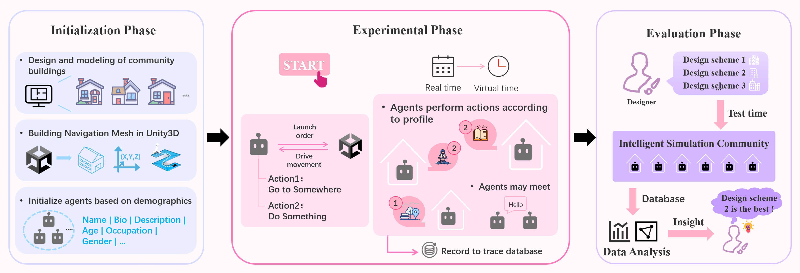
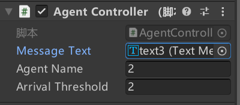
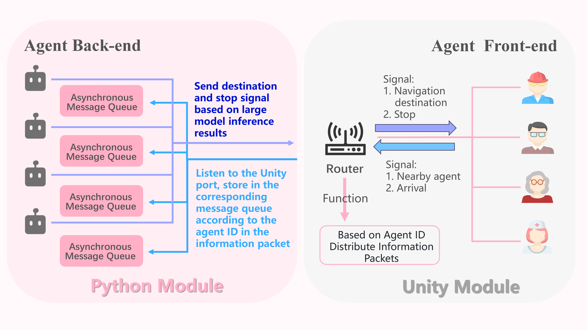

[![Python Version][python-image]][python-url]
[![PyTest Status][pytest-image]][pytest-url]
[![Star][star-image]][star-url]


______________________________________________________________________

# 🧊 CUBE: Dynamic Simulations in Customized Unity3D-Based Environments with Large Language Model-Based Multi-Agent Systems

## 📝 Overview

<p align="center">
  
</p>

🧊 CUBE can assist LLM-powered agents in simulating human daily activities and social interactions within customized Unity3D environments. This could potentially be beneficial in evaluating architectural designs and multi-agent simulation management games. CUBE's codebase is adopted from [OASIS](https://github.com/camel-ai/oasis), and its agents are inherited from [CAMEL](https://github.com/camel-ai/camel).

### Workflow

1️⃣ *Initialization Phase:* This phase involves the design and modeling of the environment, which is then imported into Unity3D for navigation mesh setup, and character models are imported as navigation agents. Room coordinates are configured in Python, and each agent's occupation, age, description, and other information are initialized in a JSON file.

2️⃣ *Experimentation Phase:* The virtual experiment begins at a specified time, with real-world time linearly mapped to the virtual-world  time. Each agent, based on a large model, decides its actions according to its profile, generated daily plan, and the simulated time. Social interactions are triggered when agents encounter each other.

3️⃣ *Evaluation Phase:* All data from the experiment are logged, and after multiple simulations, designers analyze the activities of the agents, such as comparing the impact of different environments and occupations on the degree of social participation of the agents.

### 🎬 Demo Video


https://github.com/user-attachments/assets/fd731734-0e85-4698-b4ec-d95fe54ddee1


https://github.com/user-attachments/assets/e1522a49-f7b7-473e-98bf-a213de341619


### 🔧 Installation

### Step 1: Clone the Repository

```bash
git clone https://github.com/yiyiyi0817/cube.git

cd cube
```

### Step 2: Create and Activate a Virtual Environment

Please choose one of the following methods to set up your environment. You only need to follow one of these methods.

- Option 1: Using Conda (Linux & macOS & windows)

```bash
conda create --name cube python=3.10
conda activate cube
```

- Option 2: Using venv (Linux & macOS)

```bash
python -m venv cube-venv
source cube-venv/bin/activate
```

- Option 3: Using venv (Windows)

```bash
python -m venv cube-venv
cube-venv\Scripts\activate
```

### Step 3: Install Necessary Packages

```bash
pip install --upgrade pip setuptools

pip install -e .  # This will install dependencies as specified in pyproject.toml
```

### 🔌 Unity initialization

### Step 1: 
Set all the obstacles in the scene to navigation static and bake them, and mount the NavMeshAgent component to all characters in the scene.

### Step 2:
Create an empty object and attach the `unity\RouterController.cs` script to it.

### Step 3:

Attach the `unity\AgentController.cs` script to each character, with the specific settings as follows. Be sure to add the corresponding message text to each character model. The Agent Name for each character starts from 0 and increases with different numbers. The meaning of Arrival Threshold is the distance in meters within which it is considered as arrival at the destination (changes are not recommended).



## 🏃Quickstart

### Step 1: Set Up Environment Variables

First, you need to add your OpenAI API key to the system's environment variables. You can obtain your OpenAI API key from [here](https://platform.openai.com/api-keys). Note that the method for doing this will vary depending on your operating system and the shell you are using.

- For Bash shell (Linux, macOS, Git Bash on Windows):\*\*

```bash
# Export your OpenAI API key
export OPENAI_API_KEY=<insert your OpenAI API key>
export OPENAI_API_BASE_URL=<insert your OpenAI API BASE URL>  #(Should you utilize an OpenAI proxy service, kindly specify this)
```

- For Windows Command Prompt:\*\*

```cmd
REM export your OpenAI API key
set OPENAI_API_KEY=<insert your OpenAI API key>
set OPENAI_API_BASE_URL=<insert your OpenAI API BASE URL>  #(Should you utilize an OpenAI proxy service, kindly specify this)
```

- For Windows PowerShell:\*\*

```powershell
# Export your OpenAI API key
$env:OPENAI_API_KEY="<insert your OpenAI API key>"
$env:OPENAI_API_BASE_URL="<insert your OpenAI API BASE URL>"  #(Should you utilize an OpenAI proxy service, kindly specify this)
```

Replace `<insert your OpenAI API key>` with your actual OpenAI API key in each case. Make sure there are no spaces around the `=` sign.

### Step 2: Modify the Character Information (Optional)

The directory `data\community\residents_info_7.json` stores information about the characters such as age, occupation, description, etc. You can modify the value of each key as needed before the experiment.

### Step 3: Run the Main Program

Please make sure to open the Unity project, but do not press the play button.

```bash
python scripts/community_simulation.py
```
First, you will see the output about the daily plan for each agent, like this:

```bash
6: model type ModelType.GPT_3_5_TURBO
Agent 6's daily plan: As a retired nurse, Amy's daily schedule is likely to be well-balanced and structured. Here's a brief outline of her daily routine:

- 7:00 am - Wake up and enjoy a peaceful morning in the garden, tending to plants and enjoying nature.
- 8:30 am - Have a healthy breakfast and plan out the day's knitting projects or volunteer activities.
- 10:00 am - Volunteer work at the local community center, engaging in activities related to health and wellness.
- 1:00 pm - Lunch break, maybe a light meal from the garden's fresh produce.
- 2:00 pm - Continue volunteering or spend time knitting thoughtful gifts for loved ones.
- 5:00 pm - Relax with a cup of tea and some knitting, reflecting on the day's activities.
- 7:00 pm - Dinner with family, sharing stories and lessons of compassion and resilience.
- 9:00 pm - Wind down with some light reading or knitting before bedtime.
- 11:00 pm - Lights out, ensuring a restful sleep until 7:00 am the next day.

Amy's schedule reflects a balance of personal hobbies, volunteer work, and family time, all while ensuring she gets enough rest to recharge for the next day.
```

When the plans for all 7 agents have been successfully generated, you will see...

```bash
Server started.
please start unity in 10s...

Waiting for connections from Unity...
```
At this point, please click the play button in Unity within 10 seconds, and then the simulation will begin.

By default, gpt-3.5-turbo is used. The script will run until you interrupt the experiment. Please interrupt the program according to the cost you can bear. Please make sure to stop in Unity first, then interrupt execution in Python. After the experiment ends, the trajectory will be stored in the db file. 

## 📖 Paper

To be published soon.

## 💡Tips

Feel free to change the prompt for the agent to perform actions in the `CommunityEnvironment` class of the `social_agent/agent_environment.py`

## 📢 News

<!-- - Public release of our dataset on Hugging Face (November 05, 2024) -->

- Initial release of CUBE github repository (November 23, 2024)


## 🔒 Limitation

Due to my limited time, many of the ideas and features I hoped for are not fully implemented in the current version. I may not update this part of the code in the near future, but perhaps I will continue to develop it when I have time next year.

*Codebase:* Because the code was adapted from an earlier version of [OASIS](https://github.com/camel-ai/oasis), some of the oasis code remains unused in it, which is a bit redundant.

*Meet:* At present, when agents meet, I only let them stop for a few seconds, without having a real conversation. This is a major flaw. However, the agent inherited from [CAMEL](https://github.com/camel-ai/camel/tree/master) has a complete interface to do this.

*Navigation:* This project is purely text-based, without a visual environment. After the agent decides to go somewhere, Unity's navigation system will navigate the agent to the destination based on the three-dimensional coordinates previously stored in Python.

*Scale:* I only conducted experiments with 7 agents, but this framework should have no limit to the number of agents increasing to dozens. From the python side, because it inherits from [OASIS](https://github.com/camel-ai/oasis), CUBE can also support inference and request distribution for millions of agents, but I'm not sure about the quantity bottleneck of Unity3D in terms of rendering and other aspects.

*RAG:* Unfortunately, at present, the agent only uses basic memory. However, further support for RAG may be more closely combined with research in social sciences and architecture, helping agents behave more like humans.

## 🗝️ Contributing to 🧊CUBE

If my code is useful for your research or application, but you still hope for some extended features or want to improve the content I mentioned in the limitations, I would be very happy if you could submit a Pull Request (PR) to me. If you have any questions about my code, do not hesitate to ask in the issues section or contact me via email. 

Here I have provided a schematic diagram of my communication mechanism, which might be helpful for potential contributors.

<p align="center">
  
</p>

## 🎉 Acknowledgment

Thanks to 🍓StrawberryKiller for the dedicated effort in illustrating the workflow diagram and meticulously decorating the scene in Unity3D.

[pytest-image]: https://github.com/camel-ai/camel/actions/workflows/pytest_package.yml/badge.svg
[pytest-url]: https://github.com/camel-ai/social-simulation/actions/workflows/pytest_package.yml
[python-image]: https://img.shields.io/badge/Python-3.10%2B-brightgreen.svg
[python-url]: https://docs.python.org/3.10/
[star-image]: https://img.shields.io/github/stars/yiyiyi0817/cube?label=stars&logo=github&color=brightgreen
[star-url]: https://github.com/yiyiyi0817/cube/stargazers
